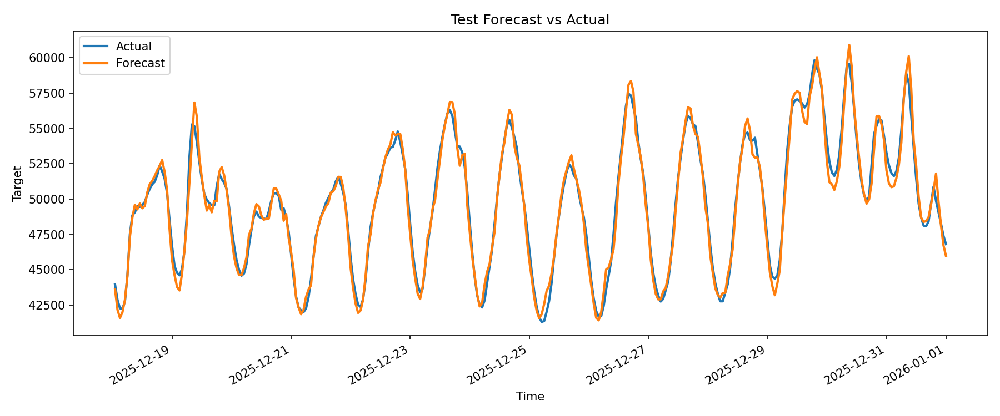
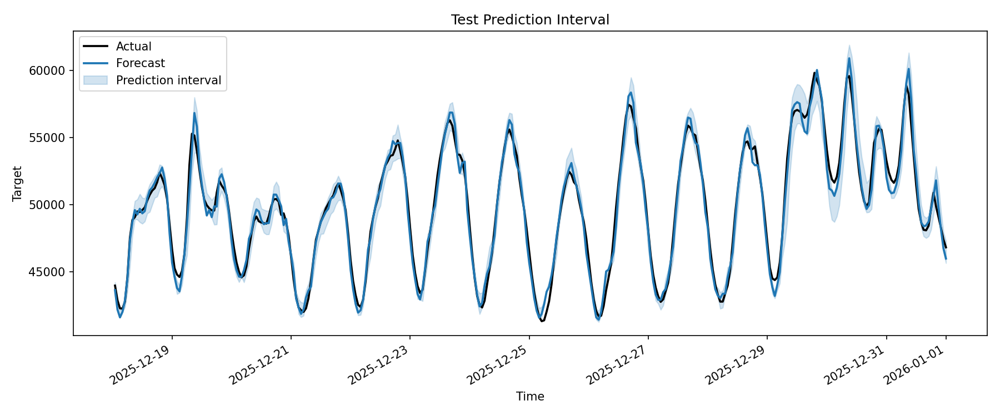
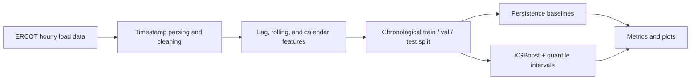

# Energy Forecasting Prototype

A lightweight research prototype for short-term electricity load forecasting with uncertainty estimation under realistic time-series data conditions.

I built this as a baseline-first forecasting project rather than a large modeling system. The current version is deliberately simple: start from ERCOT hourly load data, construct leakage-safe lag and rolling features, compare against naive persistence rules, and check whether quantile intervals are calibrated well enough to be useful.

**Current result:** on the 2025 ERCOT test split, XGBoost reaches **0.99% MAPE**, improving over a one-hour persistence baseline (**2.08% MAPE**) while also producing quantile-based prediction intervals.

## Problem

The goal is to predict short-term electricity demand from historical load patterns and calendar signals, while also estimating predictive uncertainty through forecast intervals.

From a research workflow perspective, this prototype is intended to answer three basic questions:

- Can a tabular ML baseline outperform naive persistence forecasting on hourly system load?
- Can prediction intervals be produced with minimal additional modeling complexity?
- Are the forecast intervals actually well calibrated, or are they systematically too narrow?

## Research Relevance

Short-term load forecasts are used in operational planning tasks such as unit commitment, reserve scheduling, demand response, and congestion management. Even a simple hourly forecast can be useful if it is reproducible, easy to audit, and evaluated under a time-respecting split.

The uncertainty part matters because grid operators often need more than a point estimate. A forecast interval gives a rough sense of downside and upside risk, which is relevant when deciding how much reserve capacity to hold or how aggressively to schedule flexible demand. In this prototype, the point forecast performs well against naive baselines, but the interval coverage is below the nominal level, which makes calibration a natural research follow-up rather than just an implementation detail.

I kept the first version load-only on purpose. Before adding weather, renewable generation, or more complex neural models, I wanted a baseline that makes the data assumptions, leakage controls, and evaluation outputs easy to inspect.

## Data

The default experiment uses the ERCOT 2025 hourly native load archive:

- input file: `data/Native_Load_2025.zip`
- Excel member: `Native_Load_2025.xlsx`
- timestamp column: `Hour Ending`
- target column: `ERCOT`

The loader supports CSV, Excel, and ZIP archives containing a single CSV/XLSX file. ERCOT's hour-ending timestamps are normalized automatically, including `24:00` and DST/ST suffixes.

Optional exogenous features can be added through `config.json`, but the current default experiment uses historical load and calendar features only.

For this first version, I intentionally left weather covariates out so that I could verify the load-only baseline and the no-leakage feature pipeline first. The repository reads directly from the ZIP archive, so the manually extracted folder is not needed for training.

## Method

The forecasting task is converted into a supervised learning problem by building one row per timestamp with features derived only from past observations.

Feature groups:

- lagged load values, such as `t-1`, `t-24`, and `t-168`
- rolling mean and rolling standard deviation computed after a one-step shift to avoid leakage
- calendar features including hour of day, day of week, month, and weekend indicator

Models:

- `XGBoost`: main point-forecast baseline
- `XGBoost quantile regression`: lower and upper prediction bounds
- `Persistence baselines`: naive forecasts using `t-1` and `t-24`

I kept the modeling layer small so that a future LSTM baseline can be added without rewriting the data loading, split logic, or metric code.

## Experimental Setup

The experiment uses a deterministic chronological train/validation/test split:

- train: 70%
- validation: 15%
- test: 15%

This avoids random shuffling across time and reduces leakage risk. For ERCOT 2025, the processed dataset contains:

- raw rows: 8760
- modeling rows after lag/rolling feature construction: 8592
- train / validation / test rows: 6014 / 1288 / 1290

All key settings live in `config.json`. Each run saves the resolved config, metrics, predictions, plots, feature names, and the trained model under `results/<experiment_name>/` so that the experiment can be traced later.

## Results

Current test-set results on ERCOT 2025 hourly system load:

| Model | MAE | RMSE | MAPE | Interval Coverage | Mean Interval Width |
|---|---:|---:|---:|---:|---:|
| Persistence (`t-1`) | 1051.47 | 1288.17 | 2.08% | - | - |
| Persistence (`t-24`) | 2404.80 | 3210.91 | 4.73% | - | - |
| XGBoost | 501.66 | 653.79 | 0.99% | 69.22% | 1566.72 MW |

Interpretation:

- The XGBoost baseline is clearly better than both persistence rules for point forecasting on this split.
- The 0.1 / 0.9 quantile band should behave like an 80% interval, but test coverage is only 69.22% with an average width of 1566.72 MW. So the current uncertainty estimate looks overconfident, and interval calibration is an obvious next step.

### Forecast Visualization

Point forecast on the test split:



Prediction interval on the test split:



Generated artifacts include:

- `results/xgboost_baseline/metrics.json`
- `results/xgboost_baseline/test_predictions.csv`
- `results/xgboost_baseline/test_forecast_vs_actual.png`
- `results/xgboost_baseline/test_prediction_interval.png`
- persistence baseline prediction files and plots for `t-1` and `t-24`

## Project Structure

```text
energy-forecasting-prototype/
  data/
  notebooks/
  results/
  src/
    train.py
    evaluate.py
    energy_forecasting/
      config.py
      data.py
      features.py
      splits.py
      metrics.py
      plotting.py
      pipeline.py
      models/
        naive_models.py
        xgboost_models.py
  config.json
  requirements.txt
  README.md
```

## Workflow



## Quick Start

Install dependencies:

```bash
pip install -r requirements.txt
```

Run the training pipeline:

```bash
python src/train.py --config config.json
```

Re-evaluate a saved prediction file:

```bash
python src/evaluate.py --predictions-path results/xgboost_baseline/test_predictions.csv
```

If you use Windows and the `python` launcher is not available, use `py -3` instead.

## Metrics

Point forecast accuracy:

- MAE
- RMSE
- MAPE

Uncertainty quality:

- empirical interval coverage, when prediction bounds are available
- mean interval width, to show how wide the prediction bands are

## Limitations And Next Steps

Current limitations:

- the default setup is one-step-ahead forecasting, not multi-horizon day-ahead forecasting
- only one fixed chronological split is used, rather than rolling-origin backtesting
- the forecast interval is under-covered on the test set and has not been calibrated yet
- weather variables are not included in the default run; I left them out on purpose for the first load-only baseline
- no LSTM or sequence model baseline yet

Planned extensions:

- add weather features such as temperature and humidity
- add interval calibration, for example conformal prediction or residual scaling
- add rolling-origin evaluation
- implement an LSTM baseline under `src/energy_forecasting/models/`
